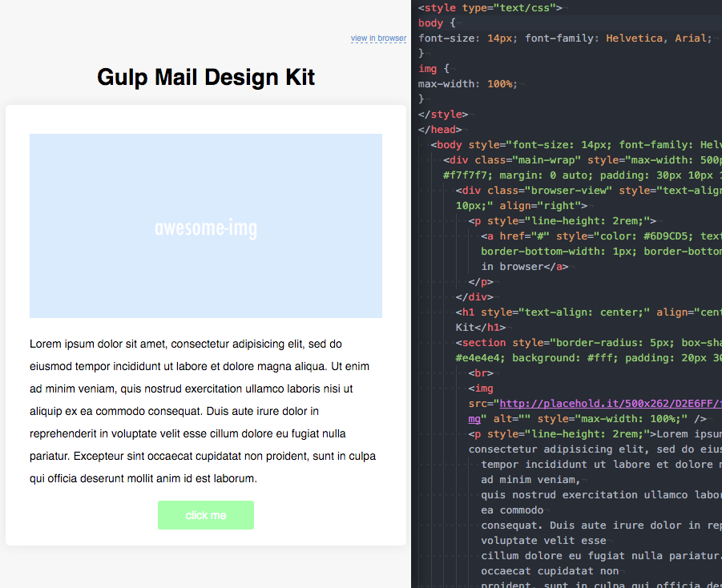

Gulp Mail Design Kit
=============================

A StartKit including full setup for GulpJS, Sass, BrowserSync to create valid html mail.



## System Preparation

To use this starter project, you'll need the following things installed on your machine.

1. [NodeJS](http://nodejs.org) - use the installer.
2. [GulpJS](https://github.com/gulpjs/gulp) - `$ npm install -g gulp` (mac users may need sudo)

## Local Installation

1. Clone this repo, or download it into a directory and run `npm install` from inside the directory.

## Usage

**development mode**

1. This will give you file watching, browser synchronisation, css inline style, auto-rebuild.

```shell
$ gulp
```
